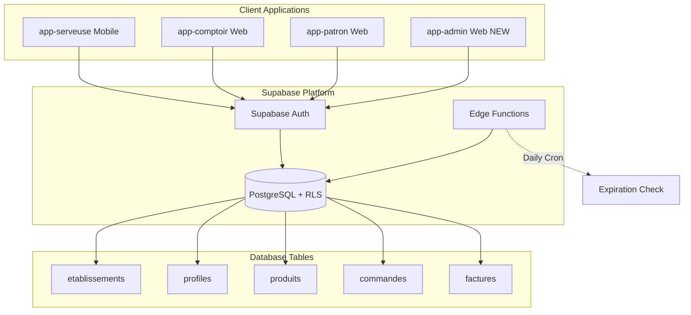
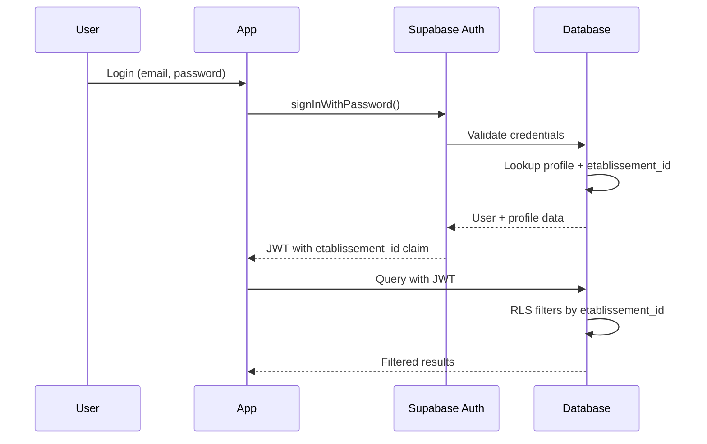
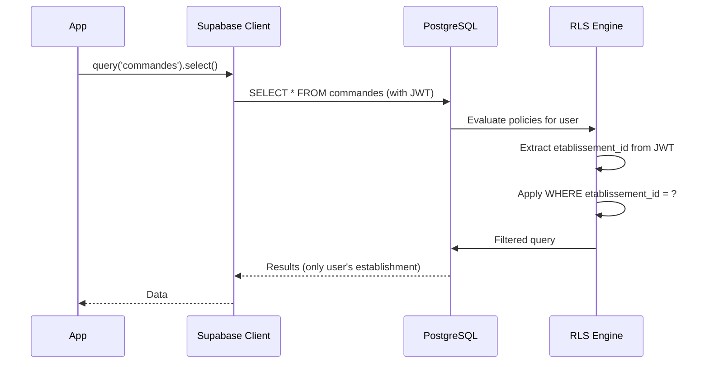
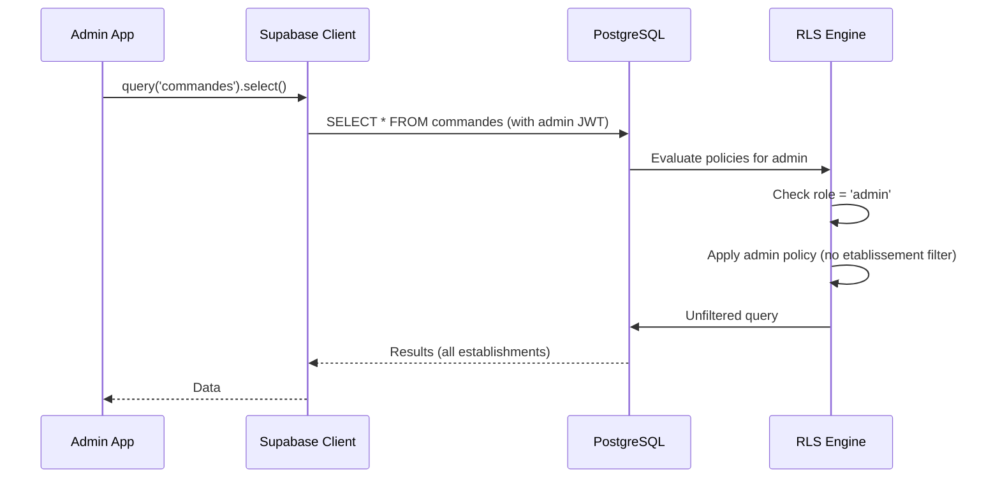
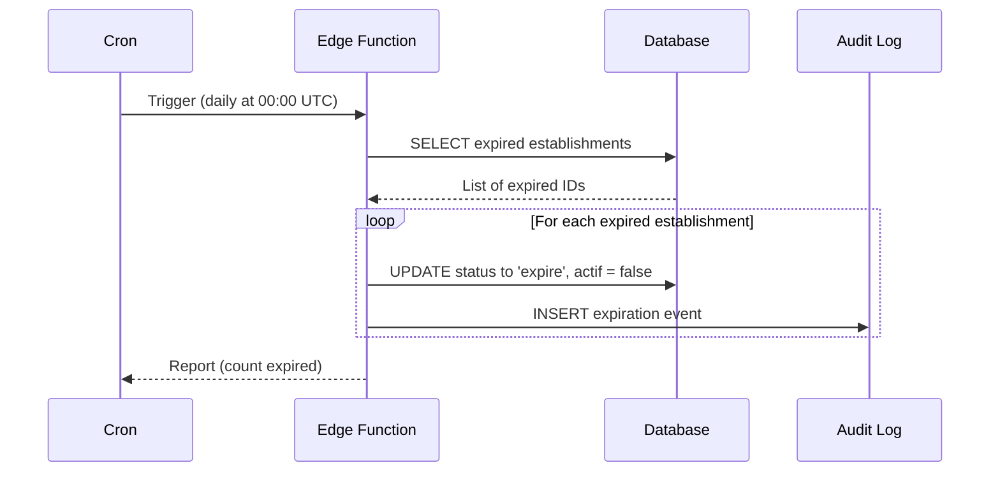
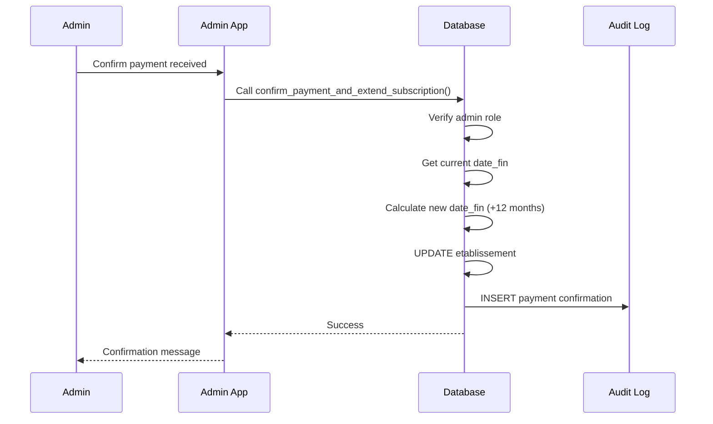

# Design Document: Multi-Tenant SaaS Platform

## Overview

This design transforms the single-tenant snack bar management system into a multi-tenant SaaS platform using PostgreSQL's Row Level Security (RLS) for data isolation. The architecture follows a shared-database, shared-schema approach where all establishments share the same tables, but data is isolated through `etablissement_id` filtering enforced at the database level.

### Key Design Decisions

1. **Shared Database Architecture**: All establishments share the same PostgreSQL database and schema, with data isolation through RLS policies
2. **Etablissement-Scoped Data**: Every table includes `etablissement_id` as a foreign key to ensure data belongs to exactly one establishment
3. **Database-Level Security**: RLS policies enforce multi-tenancy at the database layer, preventing application-level bypass
4. **Manual Payment Model**: No online payment integration; admins manually confirm payments and extend subscriptions
5. **Automatic Expiration**: Edge Function cron job handles automatic subscription expiration without manual intervention
6. **Admin Role Separation**: Admin users exist outside establishment context with cross-establishment read access

### Architecture Diagram



## Architecture

### Multi-Tenancy Model

**Shared Database, Shared Schema with RLS Isolation**

- All establishments share the same PostgreSQL database instance
- All establishments share the same table schemas
- Data isolation enforced through `etablissement_id` column + RLS policies
- Each user's session includes their `etablissement_id` in JWT claims
- RLS policies automatically filter queries by `etablissement_id`

**Benefits**:
- Cost-effective: Single database for all clients
- Easy maintenance: Schema changes apply to all establishments
- Strong isolation: Database-level security prevents data leaks
- Scalable: PostgreSQL handles thousands of establishments

**Trade-offs**:
- All establishments must use the same schema version
- Database-level resource sharing (connection pools, CPU, memory)
- Requires careful RLS policy design to prevent cross-tenant access

### Authentication Flow



### Admin vs Establishment User Flow

**Establishment Users**:
1. User logs in → JWT includes `etablissement_id` from profile
2. All queries automatically filtered by `etablissement_id` via RLS
3. User can only see/modify data from their establishment
4. User cannot change their `etablissement_id`

**Admin Users**:
1. Admin logs in → JWT has `role = 'admin'`, `etablissement_id = NULL`
2. Admin queries bypass establishment filtering (special RLS policies)
3. Admin can read data from all establishments
4. Admin can manage establishments, subscriptions, and users
5. Admin cannot perform establishment-specific operations (e.g., create orders) without context

## Components and Interfaces

### 1. Database Schema Changes

#### New Table: `etablissements`

```sql
CREATE TABLE etablissements (
  id UUID PRIMARY KEY DEFAULT uuid_generate_v4(),
  nom TEXT NOT NULL,
  adresse TEXT,
  telephone TEXT,
  email TEXT,
  
  -- Subscription management
  statut_abonnement TEXT NOT NULL CHECK (statut_abonnement IN ('actif', 'expire', 'suspendu')),
  date_debut TIMESTAMPTZ NOT NULL DEFAULT NOW(),
  date_fin TIMESTAMPTZ NOT NULL,
  actif BOOLEAN NOT NULL DEFAULT true,
  
  -- Payment tracking
  dernier_paiement_date TIMESTAMPTZ,
  dernier_paiement_confirme_par UUID REFERENCES auth.users(id),
  
  -- Metadata
  date_creation TIMESTAMPTZ NOT NULL DEFAULT NOW(),
  date_modification TIMESTAMPTZ NOT NULL DEFAULT NOW()
);

CREATE INDEX idx_etablissements_statut ON etablissements(statut_abonnement);
CREATE INDEX idx_etablissements_date_fin ON etablissements(date_fin);
CREATE INDEX idx_etablissements_actif ON etablissements(actif);
```

#### Modified Tables: Add `etablissement_id`

All existing tables must be modified to include `etablissement_id`:

```sql
-- Example for profiles table
ALTER TABLE profiles 
  ADD COLUMN etablissement_id UUID REFERENCES etablissements(id) ON DELETE RESTRICT;

CREATE INDEX idx_profiles_etablissement ON profiles(etablissement_id);

-- Apply to ALL tables:
-- profiles, produits, stock, mouvements_stock, tables, 
-- commandes, commande_items, ravitaillements, ravitaillement_items,
-- factures, encaissements, audit_logs
```

**Foreign Key Strategy**:
- `ON DELETE RESTRICT`: Prevent deletion of establishment if data exists
- All foreign keys include `etablissement_id` for referential integrity within establishment scope

#### Admin Role Support

```sql
-- Modify profiles table to support admin role
ALTER TABLE profiles 
  DROP CONSTRAINT IF EXISTS profiles_role_check;

ALTER TABLE profiles
  ADD CONSTRAINT profiles_role_check 
  CHECK (role IN ('serveuse', 'comptoir', 'gerant', 'patron', 'admin'));

-- Admin users have NULL etablissement_id
ALTER TABLE profiles
  DROP CONSTRAINT IF EXISTS profiles_etablissement_id_fkey;

ALTER TABLE profiles
  ADD CONSTRAINT profiles_etablissement_id_fkey
  FOREIGN KEY (etablissement_id) 
  REFERENCES etablissements(id) 
  ON DELETE RESTRICT
  DEFERRABLE INITIALLY DEFERRED;

-- Allow NULL for admin users
ALTER TABLE profiles
  ALTER COLUMN etablissement_id DROP NOT NULL;

-- Add check: admin users must have NULL etablissement_id, others must have non-NULL
ALTER TABLE profiles
  ADD CONSTRAINT profiles_admin_etablissement_check
  CHECK (
    (role = 'admin' AND etablissement_id IS NULL) OR
    (role != 'admin' AND etablissement_id IS NOT NULL)
  );
```

### 2. RLS Policy Modifications

#### Pattern: Establishment-Scoped Policies

All existing RLS policies must be modified to include `etablissement_id` filtering:

**Before (single-tenant)**:
```sql
CREATE POLICY "serveuses_can_read_own_commandes"
  ON commandes FOR SELECT
  TO authenticated
  USING (
    serveuse_id = auth.uid()
  );
```

**After (multi-tenant)**:
```sql
CREATE POLICY "serveuses_can_read_own_commandes"
  ON commandes FOR SELECT
  TO authenticated
  USING (
    serveuse_id = auth.uid()
    AND etablissement_id = (
      SELECT etablissement_id FROM profiles WHERE id = auth.uid()
    )
  );
```

#### Admin Policies

Admin users need special policies for cross-establishment access:

```sql
-- Admin read access to all establishments
CREATE POLICY "admins_can_read_all_etablissements"
  ON etablissements FOR SELECT
  TO authenticated
  USING (
    EXISTS (
      SELECT 1 FROM profiles
      WHERE id = auth.uid()
      AND role = 'admin'
    )
  );

-- Admin read access to all commandes
CREATE POLICY "admins_can_read_all_commandes"
  ON commandes FOR SELECT
  TO authenticated
  USING (
    EXISTS (
      SELECT 1 FROM profiles
      WHERE id = auth.uid()
      AND role = 'admin'
    )
  );

-- Repeat for all tables that admins need to view
```

#### Establishment Isolation Policy

Prevent users from accessing other establishments' data:

```sql
-- Generic pattern for all tables
CREATE POLICY "users_can_only_access_own_etablissement"
  ON {table_name} FOR ALL
  TO authenticated
  USING (
    etablissement_id = (
      SELECT etablissement_id FROM profiles WHERE id = auth.uid()
    )
  )
  WITH CHECK (
    etablissement_id = (
      SELECT etablissement_id FROM profiles WHERE id = auth.uid()
    )
  );
```

### 3. Subscription Management Functions

#### Function: Confirm Payment and Extend Subscription

```sql
CREATE OR REPLACE FUNCTION confirm_payment_and_extend_subscription(
  p_etablissement_id UUID,
  p_admin_user_id UUID
)
RETURNS void AS $$
DECLARE
  v_current_date_fin TIMESTAMPTZ;
BEGIN
  -- Verify caller is admin
  IF NOT EXISTS (
    SELECT 1 FROM profiles 
    WHERE id = p_admin_user_id 
    AND role = 'admin'
  ) THEN
    RAISE EXCEPTION 'Only admins can confirm payments';
  END IF;
  
  -- Get current end date
  SELECT date_fin INTO v_current_date_fin
  FROM etablissements
  WHERE id = p_etablissement_id;
  
  -- Extend subscription by 12 months from current end date
  UPDATE etablissements
  SET 
    date_fin = v_current_date_fin + INTERVAL '12 months',
    statut_abonnement = 'actif',
    actif = true,
    dernier_paiement_date = NOW(),
    dernier_paiement_confirme_par = p_admin_user_id,
    date_modification = NOW()
  WHERE id = p_etablissement_id;
  
  -- Log the action
  INSERT INTO audit_logs (
    user_id, 
    action, 
    table_name, 
    record_id, 
    details,
    etablissement_id
  )
  VALUES (
    p_admin_user_id,
    'PAYMENT_CONFIRMED',
    'etablissements',
    p_etablissement_id,
    jsonb_build_object(
      'new_date_fin', v_current_date_fin + INTERVAL '12 months',
      'payment_date', NOW()
    ),
    p_etablissement_id
  );
END;
$$ LANGUAGE plpgsql SECURITY DEFINER;
```

#### Function: Suspend Establishment

```sql
CREATE OR REPLACE FUNCTION suspend_etablissement(
  p_etablissement_id UUID,
  p_admin_user_id UUID,
  p_reason TEXT
)
RETURNS void AS $$
BEGIN
  -- Verify caller is admin
  IF NOT EXISTS (
    SELECT 1 FROM profiles 
    WHERE id = p_admin_user_id 
    AND role = 'admin'
  ) THEN
    RAISE EXCEPTION 'Only admins can suspend establishments';
  END IF;
  
  UPDATE etablissements
  SET 
    statut_abonnement = 'suspendu',
    actif = false,
    date_modification = NOW()
  WHERE id = p_etablissement_id;
  
  -- Log the action
  INSERT INTO audit_logs (
    user_id, 
    action, 
    table_name, 
    record_id, 
    details,
    etablissement_id
  )
  VALUES (
    p_admin_user_id,
    'ESTABLISHMENT_SUSPENDED',
    'etablissements',
    p_etablissement_id,
    jsonb_build_object('reason', p_reason),
    p_etablissement_id
  );
END;
$$ LANGUAGE plpgsql SECURITY DEFINER;
```

#### Function: Reactivate Establishment

```sql
CREATE OR REPLACE FUNCTION reactivate_etablissement(
  p_etablissement_id UUID,
  p_admin_user_id UUID
)
RETURNS void AS $$
BEGIN
  -- Verify caller is admin
  IF NOT EXISTS (
    SELECT 1 FROM profiles 
    WHERE id = p_admin_user_id 
    AND role = 'admin'
  ) THEN
    RAISE EXCEPTION 'Only admins can reactivate establishments';
  END IF;
  
  UPDATE etablissements
  SET 
    statut_abonnement = 'actif',
    actif = true,
    date_modification = NOW()
  WHERE id = p_etablissement_id;
  
  -- Log the action
  INSERT INTO audit_logs (
    user_id, 
    action, 
    table_name, 
    record_id, 
    details,
    etablissement_id
  )
  VALUES (
    p_admin_user_id,
    'ESTABLISHMENT_REACTIVATED',
    'etablissements',
    p_etablissement_id,
    jsonb_build_object('reactivation_date', NOW()),
    p_etablissement_id
  );
END;
$$ LANGUAGE plpgsql SECURITY DEFINER;
```

### 4. Edge Function: Automatic Expiration

#### Supabase Edge Function Structure

```typescript
// supabase/functions/expire-subscriptions/index.ts

import { createClient } from 'https://esm.sh/@supabase/supabase-js@2';

interface EtablissementToExpire {
  id: string;
  nom: string;
  date_fin: string;
}

Deno.serve(async (req) => {
  try {
    // Create Supabase client with service role key (bypasses RLS)
    const supabaseAdmin = createClient(
      Deno.env.get('SUPABASE_URL') ?? '',
      Deno.env.get('SUPABASE_SERVICE_ROLE_KEY') ?? ''
    );

    // Find establishments with expired subscriptions
    const { data: expiredEtablissements, error: queryError } = await supabaseAdmin
      .from('etablissements')
      .select('id, nom, date_fin')
      .eq('statut_abonnement', 'actif')
      .lt('date_fin', new Date().toISOString());

    if (queryError) {
      throw queryError;
    }

    const results = [];

    // Expire each establishment
    for (const etablissement of expiredEtablissements || []) {
      const { error: updateError } = await supabaseAdmin
        .from('etablissements')
        .update({
          statut_abonnement: 'expire',
          actif: false,
          date_modification: new Date().toISOString()
        })
        .eq('id', etablissement.id);

      if (updateError) {
        console.error(`Failed to expire ${etablissement.nom}:`, updateError);
        results.push({ id: etablissement.id, success: false, error: updateError.message });
      } else {
        // Log the expiration
        await supabaseAdmin.from('audit_logs').insert({
          user_id: null, // System action
          action: 'SUBSCRIPTION_EXPIRED',
          table_name: 'etablissements',
          record_id: etablissement.id,
          details: {
            nom: etablissement.nom,
            date_fin: etablissement.date_fin,
            expired_at: new Date().toISOString()
          },
          etablissement_id: etablissement.id
        });

        results.push({ id: etablissement.id, success: true });
      }
    }

    return new Response(
      JSON.stringify({
        success: true,
        expired_count: results.filter(r => r.success).length,
        results
      }),
      { headers: { 'Content-Type': 'application/json' } }
    );

  } catch (error) {
    console.error('Error in expire-subscriptions function:', error);
    return new Response(
      JSON.stringify({ success: false, error: error.message }),
      { status: 500, headers: { 'Content-Type': 'application/json' } }
    );
  }
});
```

#### Cron Configuration

```sql
-- In Supabase dashboard or via SQL
SELECT cron.schedule(
  'expire-subscriptions-daily',
  '0 0 * * *', -- Every day at midnight UTC
  $$
  SELECT net.http_post(
    url := 'https://[project-ref].supabase.co/functions/v1/expire-subscriptions',
    headers := jsonb_build_object('Authorization', 'Bearer ' || current_setting('app.settings.service_role_key'))
  );
  $$
);
```

### 5. Admin Dashboard Application (app-admin)

#### Technology Stack

- **Framework**: React 18 with TypeScript
- **Routing**: React Router v6
- **State Management**: Zustand (consistent with other apps)
- **UI Library**: Same component library as app-patron
- **Data Fetching**: Custom hooks with Supabase client
- **Authentication**: Supabase Auth

#### Application Structure

```
app-admin/
├── src/
│   ├── components/
│   │   ├── Layout.tsx
│   │   ├── EtablissementCard.tsx
│   │   ├── SubscriptionStatus.tsx
│   │   └── StatisticsCard.tsx
│   ├── screens/
│   │   ├── LoginScreen.tsx
│   │   ├── DashboardScreen.tsx
│   │   ├── EtablissementsScreen.tsx
│   │   ├── EtablissementDetailScreen.tsx
│   │   ├── CreateEtablissementScreen.tsx
│   │   └── GlobalStatsScreen.tsx
│   ├── hooks/
│   │   ├── useSupabaseQuery.ts
│   │   ├── useSupabaseMutation.ts
│   │   └── useAdminAuth.ts
│   ├── store/
│   │   └── authStore.ts
│   ├── types/
│   │   └── database.types.ts
│   └── App.tsx
```

#### Key Admin Dashboard Screens

**1. Dashboard Screen**:
- Overview statistics (total establishments, active, expired, suspended)
- Recent activity feed
- Establishments expiring soon (within 30 days)
- Quick actions (create establishment, confirm payment)

**2. Establishments Screen**:
- Searchable/filterable list of all establishments
- Status indicators (actif, expire, suspendu)
- Subscription end dates
- Quick actions per establishment (view, suspend, confirm payment)

**3. Establishment Detail Screen**:
- Full establishment information
- Subscription history
- Payment confirmation history
- User list for the establishment
- Activity logs for the establishment
- Actions: suspend, reactivate, confirm payment, edit details

**4. Create Establishment Screen**:
- Form to create new establishment
- Fields: name, address, phone, email
- Automatically sets subscription start date and calculates end date
- Creates initial admin user for the establishment

**5. Global Statistics Screen**:
- Revenue metrics (total subscriptions, monthly recurring revenue)
- Growth charts (new establishments over time)
- Churn metrics (expired establishments)
- User statistics across all establishments

### 6. Modified Existing Applications

#### Changes to app-serveuse, app-comptoir, app-patron

**1. Display Establishment Context**:
```typescript
// Add to Layout component header
const { user } = useAuthStore();
const { data: profile } = useSupabaseQuery(
  ['profile', user?.id],
  async () => {
    const { data } = await supabase
      .from('profiles')
      .select('*, etablissement:etablissements(nom)')
      .eq('id', user?.id)
      .single();
    return data;
  }
);

// Display in header
<div className="etablissement-info">
  {profile?.etablissement?.nom}
</div>
```

**2. Subscription Expiration Warning** (patron app only):
```typescript
// Add to DashboardScreen
const { data: etablissement } = useSupabaseQuery(
  ['etablissement', profile?.etablissement_id],
  async () => {
    const { data } = await supabase
      .from('etablissements')
      .select('*')
      .eq('id', profile?.etablissement_id)
      .single();
    return data;
  }
);

// Show warning if expiring within 30 days
const daysUntilExpiration = differenceInDays(
  new Date(etablissement.date_fin),
  new Date()
);

{daysUntilExpiration <= 30 && daysUntilExpiration > 0 && (
  <Alert severity="warning">
    Votre abonnement expire dans {daysUntilExpiration} jours. 
    Contactez l'administrateur pour renouveler.
  </Alert>
)}
```

**3. Access Denial for Expired Accounts**:
```typescript
// Add to auth middleware/guard
const checkSubscriptionStatus = async (userId: string) => {
  const { data: profile } = await supabase
    .from('profiles')
    .select('etablissement:etablissements(actif, statut_abonnement)')
    .eq('id', userId)
    .single();
  
  if (!profile?.etablissement?.actif || 
      profile?.etablissement?.statut_abonnement !== 'actif') {
    throw new Error('Votre abonnement a expiré. Contactez l\'administrateur.');
  }
};
```

## Data Models

### Etablissement Model

```typescript
interface Etablissement {
  id: string;
  nom: string;
  adresse: string | null;
  telephone: string | null;
  email: string | null;
  
  // Subscription
  statut_abonnement: 'actif' | 'expire' | 'suspendu';
  date_debut: string; // ISO timestamp
  date_fin: string; // ISO timestamp
  actif: boolean;
  
  // Payment tracking
  dernier_paiement_date: string | null;
  dernier_paiement_confirme_par: string | null;
  
  // Metadata
  date_creation: string;
  date_modification: string;
}
```

### Modified Profile Model

```typescript
interface Profile {
  id: string;
  email: string;
  nom: string;
  prenom: string;
  role: 'serveuse' | 'comptoir' | 'gerant' | 'patron' | 'admin';
  etablissement_id: string | null; // NULL for admin users
  actif: boolean;
  date_creation: string;
  date_modification: string;
  
  // Relations
  etablissement?: Etablissement;
}
```

### Subscription History Model

```typescript
interface SubscriptionHistory {
  id: string;
  etablissement_id: string;
  action: 'CREATED' | 'PAYMENT_CONFIRMED' | 'EXPIRED' | 'SUSPENDED' | 'REACTIVATED';
  date_action: string;
  admin_user_id: string | null;
  details: {
    previous_date_fin?: string;
    new_date_fin?: string;
    reason?: string;
  };
}
```

### Admin Statistics Model

```typescript
interface GlobalStatistics {
  total_etablissements: number;
  etablissements_actifs: number;
  etablissements_expires: number;
  etablissements_suspendus: number;
  total_users: number;
  monthly_recurring_revenue: number; // If pricing is tracked
  etablissements_expiring_soon: number; // Within 30 days
}
```

## Data Flow Diagrams

### User Query Flow with RLS



### Admin Query Flow



### Subscription Expiration Flow



### Payment Confirmation Flow



## Correctness Properties

*A property is a characteristic or behavior that should hold true across all valid executions of a system—essentially, a formal statement about what the system should do. Properties serve as the bridge between human-readable specifications and machine-verifiable correctness guarantees.*

### Property Reflection

After analyzing all acceptance criteria, I identified the following redundancies:

**Redundant Properties Eliminated**:
1. Requirements 1.3, 1.4, 8.1, 8.2, 11.1 all test the same core property: RLS-based data isolation by etablissement_id
2. Requirements 2.6, 3.7, 4.4, 9.5, 15.4 all test the same property: access denial for inactive establishments
3. Requirements 3.4, 12.3 test the same property: subscription extension calculation
4. Requirements 4.2, 4.3, 13.4 test the same property: expiration status updates
5. Requirements 4.5, 10.4, 13.5 test the same property: audit logging for expiration
6. Requirements 6.2, 8.6, 11.5 test the same property: admin cross-establishment read access
7. Requirements 8.3, 9.1, 9.2 test the same property: INSERT validation for etablissement_id
8. Requirements 8.4, 9.4, 11.2 test the same property: UPDATE isolation by etablissement_id
9. Requirements 8.5, 11.3 test the same property: DELETE isolation by etablissement_id

**Combined Properties**:
- Data isolation properties (SELECT, INSERT, UPDATE, DELETE) combined into comprehensive multi-operation properties
- Audit logging properties combined where they test the same logging mechanism
- Access denial properties combined into a single inactive establishment property

### Core Multi-Tenancy Properties

**Property 1: Establishment Data Isolation (SELECT)**

*For any* two different establishments A and B, and any user belonging to establishment A, when that user queries any table, the results SHALL only contain records where `etablissement_id` equals A's ID.

**Validates: Requirements 1.3, 1.4, 8.1, 8.2, 11.1**

**Property 2: Establishment Data Isolation (INSERT)**

*For any* user belonging to establishment A, when that user attempts to insert a record with `etablissement_id` set to establishment B's ID (where A ≠ B), the operation SHALL be rejected by RLS policies.

**Validates: Requirements 8.3, 9.1, 9.2**

**Property 3: Establishment Data Isolation (UPDATE)**

*For any* user belonging to establishment A, when that user attempts to update a record belonging to establishment B (where A ≠ B), the operation SHALL be rejected by RLS policies.

**Validates: Requirements 8.4, 9.4, 11.2**

**Property 4: Establishment Data Isolation (DELETE)**

*For any* user belonging to establishment A, when that user attempts to delete a record belonging to establishment B (where A ≠ B), the operation SHALL be rejected by RLS policies.

**Validates: Requirements 8.5, 11.3**

**Property 5: Foreign Key Establishment Boundaries**

*For any* two tables with a foreign key relationship, when a record in the child table references a record in the parent table, both records SHALL have the same `etablissement_id`.

**Validates: Requirements 1.5, 1.6, 11.4**

**Property 6: Admin Cross-Establishment Read Access**

*For any* user with role 'admin', when that user queries any table, the results SHALL include records from all establishments (no etablissement_id filtering applied).

**Validates: Requirements 6.2, 8.6, 11.5**

**Property 7: User Cannot Modify Own Etablissement ID**

*For any* non-admin user, when that user attempts to update their own profile to change `etablissement_id`, the operation SHALL be rejected by RLS policies.

**Validates: Requirements 8.7**

### Establishment Management Properties

**Property 8: Unique Establishment IDs**

*For any* two establishment creation operations, the generated `etablissement_id` values SHALL be unique.

**Validates: Requirements 2.1**

**Property 9: Establishment Creation Defaults**

*For any* establishment creation, the record SHALL have `statut_abonnement` set to 'actif', `actif` set to true, `date_debut` set to current timestamp, and `date_fin` set to `date_debut + 12 months`.

**Validates: Requirements 2.2, 2.4, 2.5, 3.1, 3.2**

**Property 10: Valid Establishment Status Values**

*For any* attempt to set `statut_abonnement`, the value SHALL be one of: 'actif', 'expire', 'suspendu'. Any other value SHALL be rejected by CHECK constraint.

**Validates: Requirements 2.3, 3.3**

**Property 11: Inactive Establishment Access Denial**

*For any* establishment where `actif` is false OR `statut_abonnement` is not 'actif', when any user belonging to that establishment attempts to query data, the operation SHALL be denied.

**Validates: Requirements 2.6, 3.7, 4.4, 9.5, 15.4**

### Subscription Management Properties

**Property 12: Payment Confirmation Extends Subscription**

*For any* establishment with current `date_fin` value D, when an admin confirms payment, the new `date_fin` SHALL equal D + 12 months, `statut_abonnement` SHALL be 'actif', and `actif` SHALL be true.

**Validates: Requirements 3.4, 3.5, 12.3**

**Property 13: Payment Confirmation Audit Fields**

*For any* payment confirmation operation, the establishment record SHALL have `dernier_paiement_date` set to current timestamp and `dernier_paiement_confirme_par` set to the confirming admin's user ID.

**Validates: Requirements 3.6, 12.5**

**Property 14: Subscription Renewal Reactivates Expired Establishment**

*For any* establishment with `statut_abonnement` equal to 'expire', when an admin confirms payment, the `statut_abonnement` SHALL change to 'actif' and `actif` SHALL change to true.

**Validates: Requirements 12.4**

### Automatic Expiration Properties

**Property 15: Expiration Status Updates**

*For any* establishment where current date > `date_fin` AND `statut_abonnement` equals 'actif', when the expiration function runs, the establishment SHALL have `statut_abonnement` updated to 'expire' and `actif` updated to false.

**Validates: Requirements 4.2, 4.3, 13.4**

**Property 16: Expiration Query Correctness**

*For any* execution of the expiration function, the set of establishments selected for expiration SHALL be exactly those where `date_fin < NOW()` AND `statut_abonnement = 'actif'`.

**Validates: Requirements 13.3**

**Property 17: Expiration Isolation**

*For any* establishment A that expires, all other establishments B (where A ≠ B) SHALL remain unaffected (their `statut_abonnement` and `actif` values SHALL not change).

**Validates: Requirements 11.7**

**Property 18: Expiration Error Handling**

*For any* error that occurs during expiration of a single establishment, the expiration function SHALL continue processing remaining establishments and SHALL log the error.

**Validates: Requirements 13.6**

### Admin Role Properties

**Property 19: Admin Role Validation**

*For any* profile with `role` set to 'admin', the `etablissement_id` SHALL be NULL. Conversely, for any profile with `role` not equal to 'admin', the `etablissement_id` SHALL NOT be NULL.

**Validates: Requirements 6.1, 6.3, 14.2**

**Property 20: Admin Operation Restrictions**

*For any* admin user, when that user attempts to perform an establishment-specific operation (create commande, create ravitaillement, etc.) without specifying an etablissement context, the operation SHALL be rejected.

**Validates: Requirements 6.4, 11.6**

### Audit Logging Properties

**Property 21: Admin Action Audit Logging**

*For any* admin action (create establishment, confirm payment, suspend establishment, reactivate establishment), an audit log entry SHALL be created with `action` field identifying the action type, `user_id` set to the admin's ID, and `etablissement_id` set to the target establishment's ID.

**Validates: Requirements 6.5, 10.1, 10.2, 10.3**

**Property 22: Expiration Audit Logging**

*For any* automatic expiration of an establishment, an audit log entry SHALL be created with `action` set to 'SUBSCRIPTION_EXPIRED', `user_id` set to NULL (system action), and `etablissement_id` set to the expired establishment's ID.

**Validates: Requirements 4.5, 10.4, 13.5**

**Property 23: Audit Log Etablissement ID**

*For any* audit log entry, the `etablissement_id` field SHALL be populated with the ID of the establishment related to the action (or NULL for system-wide actions).

**Validates: Requirements 10.6**

**Property 24: Audit Log Actor Distinction**

*For any* audit log entry, if `user_id` is NULL, the action SHALL be identifiable as a system action. If `user_id` is not NULL and the user has role 'admin', the action SHALL be identifiable as an admin action.

**Validates: Requirements 10.7**

**Property 25: Admin Login Audit Logging**

*For any* admin user login, an audit log entry SHALL be created with `action` set to 'ADMIN_LOGIN' and `user_id` set to the admin's ID.

**Validates: Requirements 14.7**

### User Management Properties

**Property 26: User Establishment Inheritance**

*For any* user creation operation performed by user A belonging to establishment E, the newly created user SHALL have `etablissement_id` set to E.

**Validates: Requirements 9.1, 9.2**

**Property 27: User List Filtering**

*For any* user belonging to establishment A, when that user queries the profiles table, the results SHALL only include users where `etablissement_id` equals A's ID.

**Validates: Requirements 9.3**

**Property 28: Role Hierarchy Preservation**

*For any* user with a specific role (serveuse, comptoir, gerant, patron) in establishment A, the user's permissions SHALL match the original role-based permissions, filtered to only data from establishment A.

**Validates: Requirements 9.6**

### Migration Properties

**Property 29: Migration Idempotence**

*For any* migration script, running the migration multiple times SHALL produce the same final database state as running it once.

**Validates: Requirements 7.5**

**Property 30: Existing Functionality Preservation**

*For any* existing operation (create commande, validate commande, create ravitaillement, etc.) that worked before multi-tenancy, the operation SHALL continue to work after multi-tenancy implementation when performed by a user within their establishment context.

**Validates: Requirements 15.6**

## Error Handling

### Database-Level Error Handling

**RLS Policy Violations**:
- When a user attempts cross-establishment access, PostgreSQL returns: `new row violates row-level security policy`
- Application should catch this and display: "Accès refusé: vous ne pouvez accéder qu'aux données de votre établissement"

**CHECK Constraint Violations**:
- Invalid status values rejected with: `new row violates check constraint`
- Application should validate status values before submission

**Foreign Key Violations**:
- Cross-establishment foreign key attempts rejected with: `insert or update violates foreign key constraint`
- Application should ensure all related records have matching etablissement_id

**Admin Permission Errors**:
- Non-admin users attempting admin functions: `Only admins can [action]` (raised by SECURITY DEFINER functions)
- Application should check user role before calling admin functions

### Edge Function Error Handling

**Expiration Function Errors**:
```typescript
try {
  // Expire establishment
  await supabaseAdmin.from('etablissements').update(...)
} catch (error) {
  console.error(`Failed to expire establishment ${id}:`, error);
  // Log error but continue with other establishments
  await supabaseAdmin.from('audit_logs').insert({
    action: 'EXPIRATION_ERROR',
    details: { error: error.message, etablissement_id: id }
  });
}
```

**Network/Database Errors**:
- Edge function should retry failed operations
- Log all errors for admin review
- Return summary of successes and failures

### Application-Level Error Handling

**Expired Subscription Access**:
```typescript
// Check subscription status on login
if (!etablissement.actif || etablissement.statut_abonnement !== 'actif') {
  throw new Error(
    'Votre abonnement a expiré. Veuillez contacter l\'administrateur pour renouveler.'
  );
}
```

**Admin Dashboard Errors**:
- Display user-friendly messages for all database errors
- Log errors for debugging
- Provide retry mechanisms for transient failures

## Testing Strategy

### Dual Testing Approach

This feature requires both unit tests and property-based tests:

**Unit Tests**: Verify specific examples, edge cases, and error conditions
- Schema validation (tables, columns, constraints exist)
- Migration correctness (default establishment created, all records migrated)
- Function behavior (payment confirmation, suspension, reactivation)
- Edge function logic (expiration query, status updates)

**Property Tests**: Verify universal properties across all inputs
- Data isolation across all CRUD operations
- Admin access patterns
- Subscription calculations
- Audit logging completeness

### Property-Based Testing Configuration

**Testing Library**: fast-check (TypeScript property-based testing)

**Test Configuration**:
- Minimum 100 iterations per property test
- Each test references its design document property
- Tag format: `**Feature: multi-tenant-saas, Property {number}: {property_text}**`

**Test Database Setup**:
- Use real PostgreSQL database (no mocks for RLS testing)
- Create multiple test establishments with isolated data
- Create test users for each establishment and role
- Clean up between tests (truncate tables, preserve schema)

### Key Test Scenarios

**Multi-Establishment Test Setup**:
```typescript
// Create 3 establishments with users and data
const etablissementA = await createTestEtablissement('Restaurant A');
const etablissementB = await createTestEtablissement('Restaurant B');
const etablissementC = await createTestEtablissement('Restaurant C');

const userA = await createTestUser(etablissementA.id, 'serveuse');
const userB = await createTestUser(etablissementB.id, 'serveuse');
const adminUser = await createTestUser(null, 'admin');

// Create test data for each establishment
await createTestCommandes(etablissementA.id, 10);
await createTestCommandes(etablissementB.id, 10);
await createTestCommandes(etablissementC.id, 10);
```

**Property Test Example**:
```typescript
test('Property 1: Establishment Data Isolation (SELECT)', async () => {
  // **Feature: multi-tenant-saas, Property 1: Establishment Data Isolation (SELECT)**
  
  await fc.assert(
    fc.asyncProperty(
      fc.record({
        etablissementAData: fc.array(commandeArbitrary, { minLength: 1 }),
        etablissementBData: fc.array(commandeArbitrary, { minLength: 1 })
      }),
      async ({ etablissementAData, etablissementBData }) => {
        // Setup: Create two establishments with data
        const etabA = await createEtablissement();
        const etabB = await createEtablissement();
        const userA = await createUser(etabA.id, 'serveuse');
        
        await insertCommandes(etabA.id, etablissementAData);
        await insertCommandes(etabB.id, etablissementBData);
        
        // Test: Query as user from establishment A
        await setSessionUser(userA.id);
        const results = await query('SELECT * FROM commandes');
        
        // Verify: All results belong to establishment A
        expect(results.every(r => r.etablissement_id === etabA.id)).toBe(true);
        expect(results.length).toBe(etablissementAData.length);
      }
    ),
    { numRuns: 100 }
  );
});
```

### Test Coverage Requirements

**Must Test**:
1. All 30 correctness properties with property-based tests
2. RLS policies for all tables and all operations (SELECT, INSERT, UPDATE, DELETE)
3. Admin vs non-admin access patterns
4. Subscription lifecycle (create, extend, expire, reactivate)
5. Migration correctness and idempotence
6. Edge function expiration logic
7. Audit logging for all significant actions
8. Error handling and constraint violations

**Test Organization**:
```
tests/
├── multi-tenancy/
│   ├── data-isolation.property.test.ts      # Properties 1-5
│   ├── admin-access.property.test.ts        # Properties 6, 19-20
│   ├── establishment-mgmt.property.test.ts  # Properties 8-11
│   ├── subscription.property.test.ts        # Properties 12-14
│   ├── expiration.property.test.ts          # Properties 15-18
│   ├── audit-logging.property.test.ts       # Properties 21-25
│   ├── user-management.property.test.ts     # Properties 26-28
│   └── migration.property.test.ts           # Properties 29-30
├── migrations/
│   └── multi-tenant-migration.test.ts       # Unit tests for migration
└── edge-functions/
    └── expire-subscriptions.test.ts         # Unit tests for edge function
```

### Performance Testing

While not property-based, performance should be validated:
- RLS policy performance with 100+ establishments
- Query performance with etablissement_id indexes
- Edge function execution time (must complete < 60 seconds)
- Admin dashboard query performance (cross-establishment aggregations)
